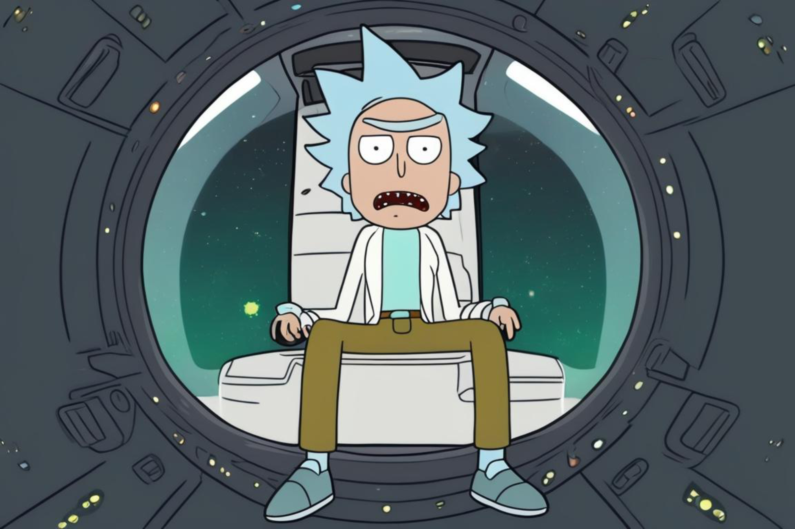
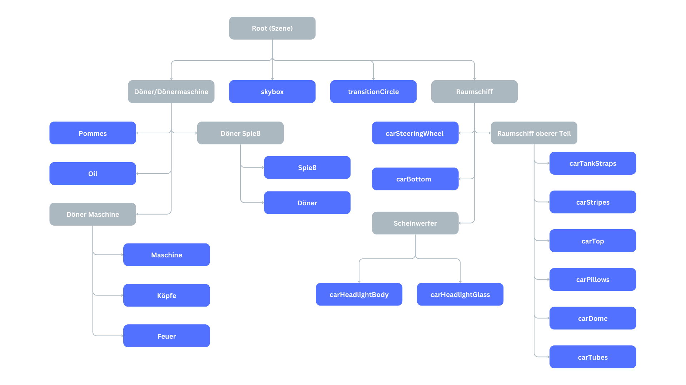

# Rick's Kebab Adventure - Ein interdimensionales OpenGL-Abenteuer


*Dieses Titelbild wurde mithilfe von Stable Diffusion XL generiert.*

## 🚀 Story

Rick, der geniale Wissenschaftler, hatte es satt, die langweiligen Döner seines Universums zu essen. Mit Entschlossenheit aktivierte er sein interdimensionales Raumschiff und begab sich auf eine Reise durch die Multiversen, um den leckersten Döner zu finden, den die Realität zu bieten hatte.
Von Dimension zu Dimension hüpfend, probierte Rick jeden Döner, den er finden konnte. Einige waren zu trocken, andere zu fettig, manche hatten seltsame Zutaten, die selbst Rick nicht identifizieren konnte. Doch er gab nicht auf.

## 👥 Teammitglieder

- [Daniel Japs](https://github.com/Daniel-Japs)
- [Julian Vottschel](https://github.com/Julianvott)
- [Mohammad Freej](https://github.com/Moka316)
- [Dario Kasumovic Carballeira](https://github.com/DarioElpapi)

## 📝 Erfüllte Anforderungen

### 1️⃣ SELBST RECHERCHIERTE ANFORDUNGEN
- ✅ Wassereffekte (Reflexion, Brechung)
- ✅ Fresnel-Effekt für Wasser
- ✅ Spotlight

### 2️⃣ ERWEITERTE ANFORDERUNGEN
- ✅ Import von Geometriedaten aus separaten Dateien
- ✅ sinnvolle Aufteilung des Codes auf mehrere Dateien (insb. Shader-Code in separaten
Dateien)
- ✅ Datentypen und Hilfsfunktionen für Shader, Geometriedaten, Texturen
- ✅ Überprüfung übergebener Funktionsparameter durch Assertions (soweit möglich)
- ✅ Tests für alle Matrixfunktionen
- ✅ Strukturierung der Szene durch einen einfachen Szenengraph
- ✅ einfache Benutzerinteraktion mit Kamera und/oder Objekten (z. B. über Tastatur)
- ✅ Beleuchtung der Szene mit mehr als einer Lichtquelle
- ❌ gleichzeitige Verwendung von mindestens zwei Texturen in einem Objekt
- ✅ gleichzeitige Verwendung von mindestens zwei verschiedenen Shader-Programmen in einer
Szene
- ✅ transparente Objekte
- ✅ Verwendung einer Umgebungstextur
- ✅ Spiegelung der Umgebungstextur auf einigen Objekten
- ❌ Nebel in einer komplexen 3D-Szene

### 3️⃣ MINDEST ANFORDERUNGEN
- ✅ README-Datei mit Informationen zum Bauen, zum Starten und zur Bedienung des
Programms
- ✅ Matrixfunktionen zur Umsetzung der benötigten Transformationen (Verschiebung, Drehung,
Skalierung, Position und Orientierung der Kamera, Perspektivprojektion, Normalenmatrix)
- ✅ mehrere Objekte in einer 3D-Szene
- ✅ Animation der Kamera und/oder eines Objekts
- ✅ Beleuchtung der Szene, wie in der Vorlesung beschrieben
- ✅ Texturierung von mindestens einem Objekt

## 🎮 Steuerung

### 👨‍🚀 FLUGSTEUERUNG
- `Pfeiltasten`: Döner inspizieren
- `L`: zurück zum Raumschiff
### 🚀 RAUMSCHIFFSTEUERUNG (Man muss im Raumschiff sitzen `L`)
- `Leertaste`: Ins nächste Multiversum reisen
- `W`: Scheinwerfer nach oben ausrichten
- `S`: Scheinwerfer nach unten ausrichten
- `Q`: Winkel des Scheinwerfers vergrößern
- `E`: Winkel des Scheinwerfers verkleinern
- `A`: Fokus des Scheinwerfers schärfer stellen
- `D`: Fokus des Scheinwerfers weicher stellen
- `R`: Scheinwerfer zurücksetzen
- `F`: Scheinwerfer ausschalten

## 🛠️ Installation und Ausführung

1. Stellen Sie sicher, dass Sie die erforderlichen Abhängigkeiten installiert haben:
   - [Abhängigkeit 1 - GLFW](https://www.glfw.org/)
   - [Abhängigkeit 2 - GLEW](https://glew.sourceforge.net/)

2. Klonen Sie dieses Repository auf Ihren lokalen Computer:
   ```
   https://github.com/Julianvott/CG-Project.git
   ```

3. Navigieren Sie in das Projektverzeichnis:
   ```
   cd CG-Project
   ```

4. Kompilieren Sie den Quellcode:
   ```
   make
   ```

5. Führen Sie das Programm aus:
   ```
   ./opengl_project.exe
   ```
6. Führen Sie das Programm mit den Matrixtests aus:
   ```
   ./opengl_project.exe -test
   ```

## 📦 Ressourcen

- [OpenGL](https://www.opengl.org/) - Die offizielle OpenGL-Website
- Texturen und 3D-Modelle:
  - [Quelle 01](https://www.aversis.be/textures/brushed-metal-texture.htm)
  - [Quelle 02](https://www.spacespheremaps.com/hdr-spheremaps/)
  - [Quelle 03](https://opengameart.org/content/seamless-space-backgrounds)
  - [Quelle 04](https://www.freepik.com/free-vector/grunge-style-background-with-scratched-texture-overlay_29081624.htm#query=scratched%20glass%20texture&position=4&from_view=keyword&track=ais_user&uuid=4c01f9cb-c0e2-48b3-9db9-d45c3ce65bb2)
  - [Quelle 05](https://www.sketchuptextureclub.com/textures/architecture/marble-slabs/black/absolute-black-slab-marble-texture-seamless-17027)
  - [Quelle 06](https://sketchfab.com/3d-models/french-fries-free-bef5383eb98b48528b2d82d8887b5bb4)
  - [Quelle 07](https://de.freepik.com/fotos-kostenlos/hohe-winkelanordnung-mit-gebratenen-kartoffeln-auf-gelbem-hintergrund_5647072.htm?query=pommes%20frites%20nahaufnahme#from_view=detail_alsolike)
  - [Quelle 08](https://de.freepik.com/vektoren-kostenlos/realistische-illustration-3d-von-edelstahlbolzen-naegel-und-schrauben-am-weissen-hintergrund_3090674.htm#query=blech%20nieten&position=6&from_view=keyword&track=ais_user&uuid=1ad1a433-6384-494d-904d-abe48acd4ede)
  - [Quelle 09](https://www.freepik.com/free-psd/top-view-delicious-cucumber-slices_37294877.htm#query=pickles%20png&position=4&from_view=keyword&track=ais_user&uuid=18f2689e-455b-4ef3-8962-b23bf2a62fcc)
  - [Quelle 10](https://www.pngegg.com/en/png-blklh)
  - [Quelle 11](https://www.cleanpng.com/png-orange-juice-clip-art-orange-702955/)
  - [Quelle 12](https://skfb.ly/orZnE)

## 📊 Szenen Graph




Viel Spaß beim Erkunden der Multiversen auf der Suche nach dem ultimativen Döner! 🚀🌌🥙
